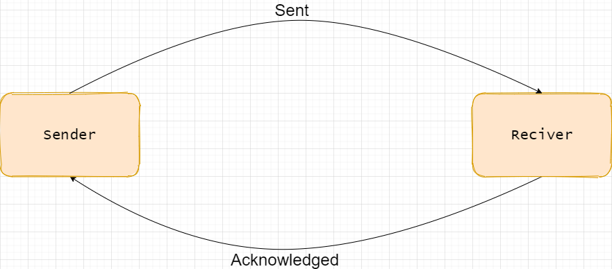
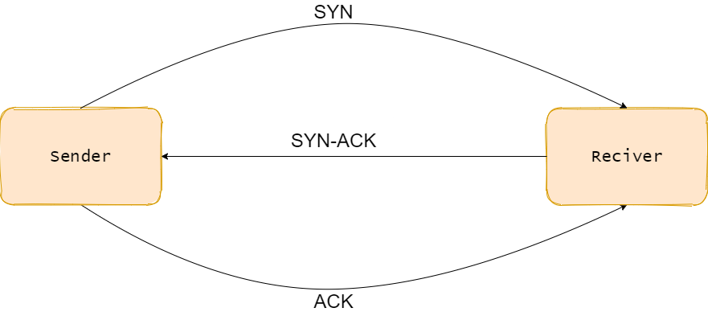

# Session One
What is networking? In computing, this is the study of how computer devices can be linked to share data.  
I say it's simply connecting computing devices together, but the word appears to refer to the *study* of this.  

How do computers communicate? Through protocols. HTTP, TCP, IP are all protocols that computers use to communicate with each other. (The 'P' at the end of all these stands for 'protocol'). Also note that here, protocol is just another way of saying 'set of rules'.

## Open Systems Interconnection (OSI) Model
This is a conceptual model that describes the seven layers computer systems use to communicate over a network.

| Layer | Mnemonic | Info
| --- | --- | --- |
| Application | *All* | info |
| Presentaion | *People* | info |
| Session | *Seem* | info |
| Transport | *To* | Where the kind of protocol used (between connection oriented and connectionless) is determined |
| Network | *Need* | Logical addresses are handled here. Think Internet Protocol (IP) addresses |
| Datalink | *Data* | This layer handles phyiscal addresses. So, Media Access Controller (MAC) addresses |
| Physical | *Protection* | Manages signals being sent between computer devices |  

---
# The Layers in more Detail

## Physical
This one is about signals

## Datalink
About addressing - giving machines their identity. Media Access Controller (MAC) addresses are considered at this level. This is a physical address.

## Network
The layer that deals with logical addresses. The kind I'm working with for the moment is IP.

## Transport
Where the kind of protocol used is determined. This is between connection oriented and connectionless.

### Connection Oriented
  
With this method of communication, the send will send a packet and reciver sends an acknowledgment of that. If the sender doesn't get that acknowledgement message, it will not send the next packet.  

**Transmission Control Protocol** (TCP) is a connection oriented protocol. It requires that a session is set up between the systems that are communicating.  
To start a session, we have something called a *3-way handshake*. It works as follows:  
  
1. The sender sends a SYN message to the device it's trying to communicate with
2. Reciver sends a SYN-ACK message back to the sender
3. Now the sender sends an ACK message and the connection between the two has been set up

Now they can communicate.  
Note that the sender always sends and the reciver always recives. If the device that is currently reciving needs to start sending, a new session must be set up.  

**Closing Connections**  
